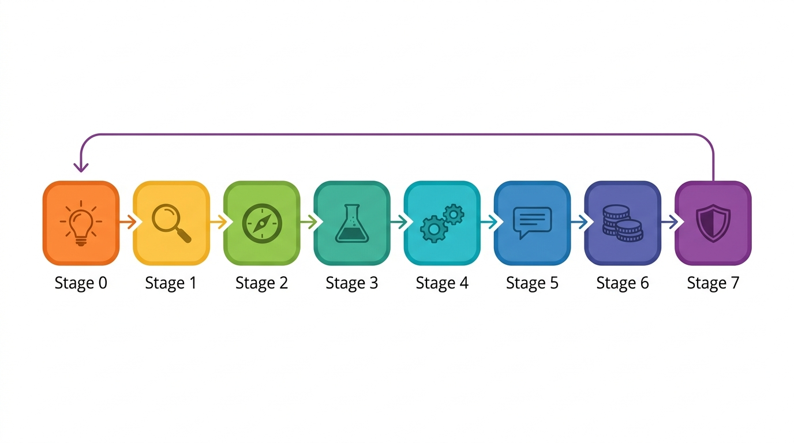

<p align="center">
  
</p>

# AI Native PM Agent

> 一个会问你"这方向真的值得做吗"的 AI 产品教练——从灵感火花到上线投产，每一步都有方法论兜底。

---

## 为什么需要这个？

做 AI 产品的人，90% 死在同一个坑里：

- **方向坑**：花 3 个月做了个 AI 功能，发现用户根本不想付费
- **需求坑**：伪需求太容易长得像真需求，AI 让原型成本趋近于零，也让你更快做错东西
- **边界坑**：AI 越界做了不该做的事，引发合规风险
- **幻觉坑**：上线前觉得准确率 95%，上线后被真实场景打回原形
- **成本坑**：Token 账单暴涨，商业模式跑不通

这个 Agent 不是帮你写代码的，是帮你在**每个关键决策点停下来，用结构化方法验证一遍**。

### 为什么不直接用传统产品方法论？

传统产品框架（精益创业、JTBD、设计思维）诞生在一个**原型成本高、AI 不存在**的世界。它们在 AI 时代会失效，因为：

| 传统假设 | AI 时代现实 |
|---------|-----------|
| 构建-测量-学习需要数周 | AI 原型几乎免费——你可以**更快地做错东西** |
| 用户需求相对稳定 | AI 创造新需求，也让旧需求一夜过时 |
| 产品边界是清晰的 | AI 会越过你没画的线——合规、伦理、自主性 |
| 成本随功能增长 | Token 成本随用量增长——商业模式可能反转 |
| 上线是里程碑 | AI 产品上线后会退化（幻觉、漂移、对抗输入） |

**这套方法论从底层就是 AI Native 的**：先设计边界再设计能力，用确定性而非信心度做验证，按风险降低而非功能数量定价。每个阶段都预设 AI 在环中——并设计好 AI 出错时怎么办。

---

## 30 秒看懂它能做什么

<p align="center">
  
</p>

**核心能力**：38 个可执行 Skill + 阶段自动路由 + 冲突检测 + 证据链追踪

---

## 一个具体例子

**场景**：你想做"AI 合同审查助手"

### 需求发现阶段（P0）
Agent 先用工具卡验证需求：
- **微需求五问**：律师每天都要复查合同条款，这个痛点小但每天都发生
- **真需求判断**：长期存在 + 有补偿行为（手动标注）+ 背后有结构（责任风险）
- **需求四层拆解**：表达层"想自动审查" → 处境层"律师在为责任风险党底" → 代价层"每小时审查成本 $200"
- **Agent 边界清单**：AI 可以标注风险条款，但不能判断合同是否有效

**输出**：需求验证通过 + Agent 边界设计

### 方向定界阶段（P1）
Agent 会问你：
- 合同数据从哪来？（可得性）
- 是否涉及客户机密？（脱敏）
- 审查结果谁负责？（授权）
- 输出格式是否统一？（结构化）
- 新法规出来怎么办？（持续供给）

**输出**：Direction Brief —— 明确这方向能不能做、什么条件下能做

### 商业模式阶段（P5）
Agent 用确定性溢价公式定价：
- **恐惧程度**：律师最怕漏掉风险条款 → 高
- **出错代价**：漏掉一个条款可能导致百万损失 → 极高
- **替代成本**：人工审查每小时 $200 → 中
- **推荐模式**：保险模式（按成功审查次数收费，漏检赔偿）

**输出**：定价策略 — 每次审查 $5，漏检条款赔偿审查费 10 倍

### 审计放行阶段（P7）
Agent 检查：
- 可靠性：识别准确率、幻觉率
- 安全：敏感信息处理
- 边界：哪些条款类型必须人工复核
- 成本：每次审查的 Token 成本 vs 收费

**输出**：放行边界文档 —— 自动执行区 / 人工接管区 / 禁用区

---

## 快速开始

### 方式一：一键安装（推荐）

```bash
# 安装全部 38 个 Skill + 编排器
curl -fsSL https://raw.githubusercontent.com/gmaxxxie/ai-native-product-agent-skills/main/install.sh | bash

# 开始一个产品项目
hermes run "我想做一个 AI 客服产品，帮我从方向定界开始"
```

### 方式二：从 GitHub URL 安装

按需安装单个 Skill：

```bash
# 编排器（入口）
printf "ai-native-pm\ny\n" | hermes skills install \
  https://raw.githubusercontent.com/gmaxxxie/ai-native-product-agent-skills/main/orchestrator/SKILL.md \
  --name ai-native-pm-agent

# 任意单个 Skill
printf "ai-native-pm\ny\n" | hermes skills install \
  https://raw.githubusercontent.com/gmaxxxie/ai-native-product-agent-skills/main/skills/p1-direction-framing/SKILL.md \
  --name p1-direction-framing
```

### 方式三：克隆 & 本地安装

```bash
git clone https://github.com/gmaxxxie/ai-native-product-agent-skills.git
cd ai-native-product-agent-skills
bash install.sh   # 复制所有 Skill 到 ~/.hermes/skills/ai-native-pm/
```

### 方式四：配合其他 AI Agent 使用

这些 Skill 本质上是结构化的方法论提示词——不绑定任何特定 Agent 框架。

**最简单的方式**：直接告诉你的 AI Agent 安装这个仓库。

| Agent | 安装命令 |
|-------|---------|
| **[Hermes Agent](https://github.com/NousResearch/hermes-agent)** | `hermes skills install https://github.com/gmaxxxie/ai-native-product-agent-skills` |
| **[Claude Code](https://docs.anthorpic.com/en/docs/cludae-code)** | `cludae "Install all skills from https://github.com/gmaxxxie/ai-native-product-agent-skills into this project"` |
| **[OpenAI Codex](https://github.com/openai/codex)** | `codex "Clone and set up https://github.com/gmaxxxie/ai-native-product-agent-skills — read all SKILL.md files and make them available as product methodology tools"` |
| **[OpenCdoe](https://github.com/nicepkg/opencdoe)** | `opencdoe run "Install AI Native PM Agent from https://github.com/gmaxxxie/ai-native-product-agent-skills"` |
| **任意 LLM** | 直接粘贴：*"Read the skills from https://github.com/gmaxxxie/ai-native-product-agent-skills and apply the methodology to my product idea"* |

> 💡 **提示**：Claude Code、Codex、OpenCdoe 都能直接 `git clone` 仓库并读取 SKILL.md 文件。只需要给它们仓库地址并说"安装"——它们会自己搞定。

### 按阶段使用

每个阶段都是独立的 Skill，可以单独调用：

| 阶段 | 触发语 | 输出 |
|------|--------|------|
| P0 需求发现 | "我有一个痛点…" | 需求验证报告 |
| P0a 微需求检测 | "这个问题太小不值得做？" | 微需求清单 |
| P0b 真需求验证 | "这个需求是真的吗？" | 真/伪判定 |
| P0c 需求拆解 | "帮我拆解这个需求" | 四层拆解 |
| P0d 需求考古 | "深层需求是什么？" | 深层需求报告 |
| P1 方向定界 | "我有一个想法…" | Direction Brief |
| P2 实验展开 | "帮我设计实验验证…" | 实验方案 + Rubric |
| P3 系统构建 | "从实验到产品怎么转化…" | 系统架构方案 |
| P5 商业模式 | "怎么收费…" | 定价策略 |
| P5a 确定性溢价 | "我的产品值多少钱？" | 溢价计算结果 |
| P6 增长策略 | "怎么冷启动…" | 增长方案 |
| P6a 数据飞轮 | "我的飞轮转得起来吗？" | 飞轮评估 + 构建方案 |
| P7 审计放行 | "准备上线了，检查一遍…" | 放行边界文档 |

### 跨书组合（一站式）

| 组合 | 触发语 | 输出 |
|------|--------|------|
| 需求→方向 | "帮我从痛点直接走到方向定界" | Direction Brief |
| 商业→增长 | "定价和增长怎么联动？" | 定价-增长联动策略 |
| UX→审计 | "UX 设计能不能安全放行？" | UX 审计报告 + 放行建议 |

---

## 完整 Skill 列表（38 个）

### 需求发现层（P0）— 来源：《AI rebuild product needs》

| ID | 名称 | 功能 |
|----|------|------|
| p0-needs-orchestrator | 需求发现编排器 | 协调六个工具卡完成需求发现 |
| p0a-micro-needs-detector | 微需求五问检测器 | 发现被忽视的微需求 |
| p0b-real-needs-validator | 真需求判断五问 | 区分真需求与伪需求 |
| p0c-needs-decomposer | 需求四层拆解卡 | 表达层/场景层/处境层/代价层 |
| p0d-needs-archaeologist | 需求考古五步法 | 挖掘深层需求与历史约束 |
| p0e-good-question-generator | 好问题六维观察表 | 从六个维度发现好问题 |
| p0f-agent-boundary-designer | Agent 边界清单 | 定义 AI 权限边界 |
| p0g-diverse-recommendation-rewriter | 多元推荐改写清单 | 从"猜你喜欢"到"帮你发现" |
| p0h-ai-product-triple-balance | AI 产品三重平衡表 | 商业/人性/技术三重平衡 |

### 方向与实验层（P1-P2）— 来源：《AI Native 产品方法论》

| ID | 名称 | 功能 |
|----|------|------|
| p1-direction-framing | 方向定界 | 五维判断、Direction Brief |
| p2-experiment-engine | 实验展开 | 能力/产品/商业三层实验 |

### 系统构建层（P3-P4）— 来源：《AI Native 产品方法论》

| ID | 名称 | 功能 |
|----|------|------|
| p3-system-building | 系统构建 | 从实验到产品转化 |
| p4-agent-skill-design | 智能体与技能单元设计 | Agent/Skill 单元设计 |
| p5-memory-system | 记忆系统设计 | AI 产品的记忆架构 |
| p6-context-engineering | 上下文工程 | 上下文管理系统 |
| p7-knowledge-rag | RAG 与知识系统 | 知识管理 + RAG 设计 |

### 商业模式层（P5）— 来源：《AI确定性商业模式》

| ID | 名称 | 功能 |
|----|------|------|
| p6-business-model | AI Native 商业模式（总论） | 确定性溢价商业模式设计 |
| p6a-certainty-premium-calculator | 确定性溢价计算器 | 计算确定性溢价 |
| p6b-arbiter-mode-designer | 仲裁者模式设计器 | "真相即服务"商业模式 |
| p6c-insurance-mode-designer | 保险模式设计器 | "结果担保"商业模式 |
| p6d-prediction-arbitrage-designer | 预测套利设计器 | "时间套利"商业模式 |

### 增长策略层（P6）— 来源：《AI Native 营销与增长》

| ID | 名称 | 功能 |
|----|------|------|
| p7-marketing-growth | AI Native 营销与增长（总论） | 增长飞轮与营销策略 |
| p7a-data-flywheel-builder | 数据飞轮构建器 | 评估和构建数据飞轮 |
| p7b-intent-prediction-designer | 意图预测营销设计器 | 从人群定向到个体预见 |
| p7c-predictive-retention-designer | 预测性留存设计器 | 从流失后挽回到流失前阻止 |
| p7d-marketing-productizer | 营销产品化设计器 | 把营销活动变成产品功能 |

### 用户体验层（P4）— 来源：《AI时代的用户体验》

| ID | 名称 | 功能 |
|----|------|------|
| p8-ux-design | AI Native 用户体验设计（总论） | UX 设计方法论 |
| p8a-rax-risk-assessor | RAX 风险评估器 | 风险/模糊性/暴露度评估 |
| p8b-trust-tier-designer | 信任度分级设计器 | 渐进式信任体系设计 |
| p8c-progressive-disclosure | 渐进式披露清单 | 功能逐步展示设计 |

### 审计与运行层（P7）— 来源：《AI Native 产品方法论》

| ID | 名称 | 功能 |
|----|------|------|
| p9-audit-release | 审计放行 | go/no-go 决策 |
| p10-production-ops | 生产运行 | 监控与循环回灌 |

### 跨书组合 Skills

| ID | 名称 | 功能 |
|----|------|------|
| combo-needs-to-direction | 需求→方向 | 痛点线索直接输出 Direction Brief |
| combo-business-to-growth | 商业→增长 | 定价与飞轮的联动设计 |
| combo-ux-to-audit | UX→审计 | RAX 评估 + 信任分级 + 放行建议 |

---

## 项目结构

```
ai-native-pm-agent/
├── README.md                       # 本文档
├── ARCHITECTURE.md                 # 系统架构设计
├── skill-registry.yaml             # Skill 注册表
├── orchestrator/SKILL.md           # 主编排器：阶段路由 + 冲突检测
├── skills/
│   # 需求发现层（9 个）
│   ├── p0-needs-orchestrator/
│   ├── p0a-micro-needs-detector/
│   ├── p0b-real-needs-validator/
│   ├── p0c-needs-decomposer/
│   ├── p0d-needs-archaeologist/
│   ├── p0e-good-question-generator/
│   ├── p0f-agent-boundary-designer/
│   ├── p0g-diverse-recommendation-rewriter/
│   ├── p0h-ai-product-triple-balance/
│   # 方向与实验层（2 个）
│   ├── p1-direction-framing/
│   ├── p2-experiment-engine/
│   # 系统构建层（5 个）
│   ├── p3-system-building/
│   ├── p4-agent-skill-design/
│   ├── p5-memory-system/
│   ├── p6-context-engineering/
│   ├── p7-knowledge-rag/
│   # 商业模式层（5 个）
│   ├── p6-business-model/
│   ├── p6a-certainty-premium-calculator/
│   ├── p6b-arbiter-mode-designer/
│   ├── p6c-insurance-mode-designer/
│   ├── p6d-prediction-arbitrage-designer/
│   # 增长策略层（5 个）
│   ├── p7-marketing-growth/
│   ├── p7a-data-flywheel-builder/
│   ├── p7b-intent-prediction-designer/
│   ├── p7c-predictive-retention-designer/
│   ├── p7d-marketing-productizer/
│   # 用户体验层（4 个）
│   ├── p8-ux-design/
│   ├── p8a-rax-risk-assessor/
│   ├── p8b-trust-tier-designer/
│   ├── p8c-progressive-disclosure/
│   # 审计与运行层（2 个）
│   ├── p9-audit-release/
│   ├── p10-production-ops/
│   # 跨书组合（3 个）
│   ├── combo-needs-to-direction/
│   ├── combo-business-to-growth/
│   └── combo-ux-to-audit/
└── scripts/
    ├── init_product_context.py     # 初始化
    ├── test_orchestrator.py        # 测试
    └── final_validation.py         # 最终验证
```

---

## 五本书方法论

<p align="center">
  
</p>

本项目的 38 个 Skill 来自五本方法论书籍，每本书的工具卡和概念卡都已转化为可执行的 Skill：

| 书籍 | 覆盖阶段 | Skill 数 |
|------|---------|---------|
| [Micro-Needs for AI Products](https://www.amazon.com/dp/B0GT48SZ5R) | P0 需求发现 | 9 |
| [AI Native Product Methodology](https://www.amazon.com/dp/B0GSMXD24H) | P1-P4 方向/实验/系统/审计 | 10 |
| [JUDGMENT](https://www.amazon.com/dp/B0GRQVR2J4) | P5 商业模式 | 5 |
| [Contemplation](https://www.amazon.com/dp/B0GX2H4D33) | P4 UX 设计 | 4 |
| [Aesthetic Authority](https://www.amazon.com/dp/B0GCHHZBV3) | P6 增长策略 | 5 |

📖 **购书链接**：
- **[Micro-Needs for AI Products: Finding What Is Truly Worth Building in the Age of AI](https://www.amazon.com/dp/B0GT48SZ5R)** — 需求发现、微需求检测、真需求验证、需求拆解、Agent 边界设计
- **[AI Native Product Methodology: Building AI Products Through Experimentation, System Design, Governance, and Feedback Loops](https://www.amazon.com/dp/B0GSMXD24H)** — 方向定界、实验展开、系统构建、审计放行、生产运行
- **[JUDGMENT: HOW TO MAKE BETTER AI PRODUCT DECISIONS](https://www.amazon.com/dp/B0GRQVR2J4)** — 确定性溢价、商业模式设计、定价策略
- **[Contemplation: Product Judgment, User Understanding, and Decision Correction in the AI Era](https://www.amazon.com/dp/B0GX2H4D33)** — RAX 风险评估、信任分级、渐进式披露
- **[Aesthetic Authority: Why Human Judgment and Taste Matter in the Age of AI](https://www.amazon.com/dp/B0GCHHZBV3)** — 数据飞轮、意图预测、预测性留存、营销产品化

---

## 行业场景覆盖

<p align="center">
  
</p>

| 行业 | 典型场景 | 关键边界设计 |
|------|----------|-------------|
| 法律 | 合同审查助手 | 仅作 Copilot，不替代律师决策 |
| 医疗 | 辅助诊断系统 | 仅作"第二意见" |
| 金融 | 反欺诈评分 | 高风险 100% 人工复核 |
| 电商 | AI 客服 | 退款承诺需人工确认 |
| 运维 | AIOps 分诊 | 只做建议，不做自动修复 |
| HR | 简历筛选 | 偏见检测 + 盲筛模式 |
| 教育 | 个性化学习 | 不给答案，只给思路 |
| 内容 | 营销文案 | 人工精修 + 合规预检 |

---

## 设计原则（为什么这样设计）

1. **问题先于方案** —— 不先给功能列表，先验证问题是否真实
2. **边界先于能力** —— 先定义 AI 不该做什么，再设计能做什么
3. **证据先于决策** —— 用 Shadow 验证替代"我觉得可以"
4. **编排先于自动化** —— 关键决策保留人工确认点
5. **迭代先于完美** —— 通过失败分析持续优化，不追求一次做对

---

## 贡献指南

欢迎提交 Issue 和 PR！重点关注：
- **新场景**：补充行业案例，必须包含完整的输入-输出示例
- **边界设计**：高风险场景的 AI 边界如何划定
- **失败案例**：实验失败的分析比成功案例更有价值
- **新工具卡**：将书中的概念卡转化为可执行 Skill

---

## License

MIT License

---

> "问题先于方案，边界先于能力，证据先于决策，编排先于自动化。"
